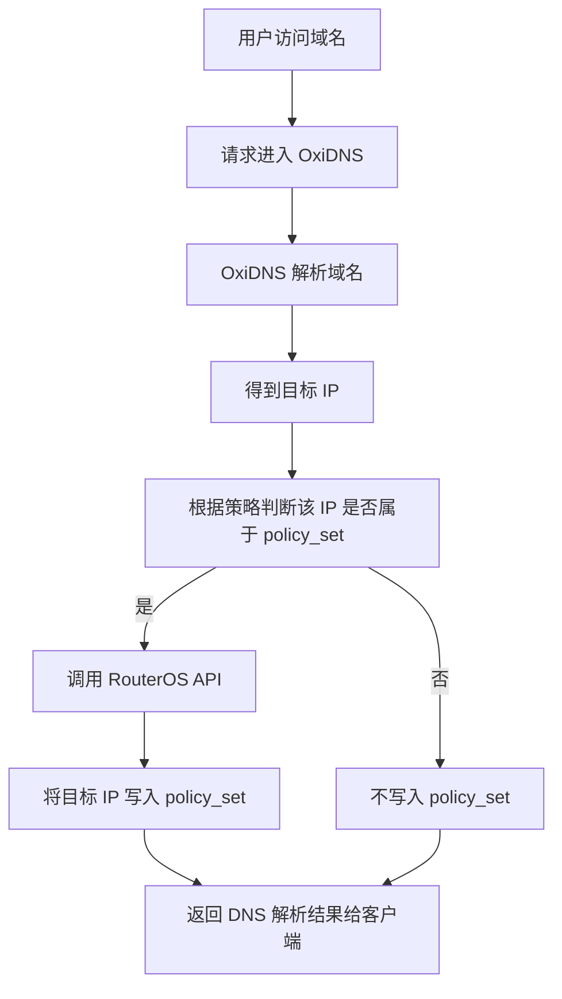
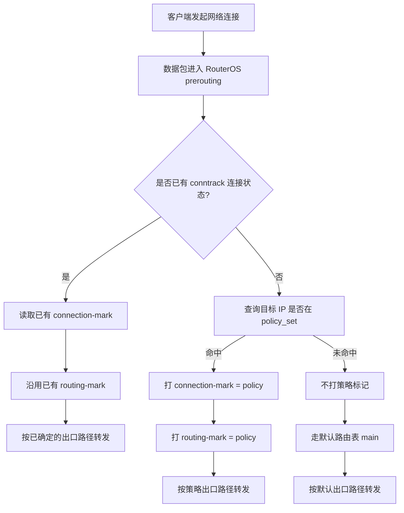

本章说明 OxiDNS 的 `ros_address_list` 执行器如何与 RouterOS `address-list`、`mangle` 和策略路由机制配合，形成“DNS 解析结果驱动后续流量出口选择”的策略路由体系。

该方案的核心设计并非在 RouterOS 侧直接匹配域名，而是采用以下处理流程：

1. 由 OxiDNS 先解析域名。
2. 从 DNS 应答中提取目标 IP。
3. 把命中的目标 IP 同步到 RouterOS 的 `address-list`。
4. RouterOS 在连接建立初始阶段，根据目标 IP 是否命中 `address-list` 决定是否打策略标记。
5. 后续同一连接沿用已有连接标记和路由标记，保持出口一致。

该设计具备以下价值：

* RouterOS 不需要重复做域名解析判断。
* 策略路由判定落在 IP 层，和 RouterOS 的原生能力自然衔接。
* OxiDNS 负责“域名 -> 目标 IP”的动态映射维护，RouterOS 负责“目标 IP -> 走哪条出口”。

## 总体工作流

### OxiDNS 侧流程



### RouterOS 侧流程



## 架构分工

### OxiDNS 的职责

* 接收 DNS 请求。
* 按既定策略解析域名。
* 从最终 DNS 响应中提取 `A` / `AAAA`。
* 把需要走策略路由的目标 IP 同步到 RouterOS `address-list`。
* 根据 TTL 持续刷新这些 IP 的有效期。

### RouterOS 的职责

* 在连接首次建立时检查目标地址是否命中策略集合。
* 命中时设置 `connection-mark` 与 `routing-mark`。
* 让同一连接后续数据包继承相同标记，不重复做策略决策。
* 根据 `routing-mark` 把流量送到对应的路由表或对应出口。

## 适用场景

这类方案尤其适合以下策略：

* 某一组域名解析结果需要走特定出口链路。
* 某类服务需要固定出口，避免不同连接被随机分流。
* 希望按“策略域名集合”驱动 RouterOS 地址列表，而不是手工维护大量目标 IP。
* 需要让 DNS 层策略和网络层策略形成闭环。

## 配置示例与参数说明

### 最小联动示例

以下示例说明：

* 先用 `qname` 识别策略域名。
* 命中后正常解析。
* 若拿到了有效答案，再交给 `ros_address_list` 把结果写入 RouterOS 的 `policy_set`。

```yaml
plugins:
  - tag: policy_domains
    type: domain_set
    args:
      exps:
        - "domain:stream.example"
        - "domain:media.example"

  - tag: match_policy_domain
    type: qname
    args:
      - "$policy_domains"

  - tag: forward_main
    type: forward
    args:
      upstreams:
        - addr: "udp://1.1.1.1:53"

  - tag: ros_address_list_policy
    type: ros_address_list
    args:
      address: "172.16.1.1:8728"
      username: "api-user"
      password: "secret"
      async: true
      address_list4: "policy_set_v4"
      address_list6: "policy_set_v6"
      comment_prefix: "oxidns"
      min_ttl: 60
      max_ttl: 1800

  - tag: seq_main
    type: sequence
    args:
      - matches: "$match_policy_domain"
        exec: "$ros_address_list_policy"
      - exec: "$forward_main"

```

## `ros_address_list` 插件在策略路由场景中的关键参数

### `address`

```yaml
address: "172.16.1.1:8728"
```

含义：

* RouterOS API 地址。
* OxiDNS 通过它连接 RouterOS 并执行 address-list 管理操作。

### `connect_timeout` / `send_timeout` / `receive_timeout`

```yaml
connect_timeout: 5
send_timeout: 5
receive_timeout: 30
```

含义：

* 分别控制 RouterOS API 连接、发送命令、接收响应数据的等待上限，单位为秒。
* 三个值都必须大于 `0`。
* `receive_timeout` 是等待下一段 RouterOS 响应数据的超时，不是整次扫描的总耗时上限。

配置建议：

* 建议为 OxiDNS 准备专用、规模可控的 `address-list`，不要直接接入已有的大型共享列表。
* 如果存量环境暂时无法拆分列表，或 RouterOS 管理面响应较慢导致启动 reconcile 扫描经常超过默认 5 秒，可优先调大 `receive_timeout`，例如 `30` 或 `60`。
* `connect_timeout` 和 `send_timeout` 通常保持默认即可，只有管理网络链路慢或 RouterOS API 偶发繁忙时再调大。

### `address_list4` / `address_list6`

```yaml
address_list4: "policy_set_v4"
address_list6: "policy_set_v6"
```

含义：

* 分别指定 IPv4 / IPv6 目标结果应写入哪个 RouterOS `address-list`。

配置建议：

* IPv4 和 IPv6 分开管理。
* 名称明确表达策略用途，例如：
  * `policy_set_v4`
  * `policy_media_v4`
  * `policy_route_alt_v6`

### `async`

```yaml
async: true
```

含义：

* 是否异步提交 RouterOS 写入。

配置建议：

* 在策略路由场景中，通常优先采用 `true`。

原因：

* DNS 响应不应该因为 RouterOS API 延迟而被明显拖慢。
* `ros_address_list` 的主要职责是联动，而非阻塞主解析路径。
* 启动阶段的 RouterOS address-list 扫描在后台执行；即使存量列表查询较慢或管理面响应慢，也不应阻塞 DNS 服务启动。
* 后台化只降低对 DNS 启动和请求路径的影响，不代表推荐接入大型 address-list。

### `min_ttl` / `max_ttl`

```yaml
min_ttl: 60
max_ttl: 1800
```

含义：

* 约束动态写入 address-list 的有效期。

设计意义：

* 防止 TTL 太小导致 RouterOS 高频刷新。
* 防止 TTL 太大导致陈旧 IP 长时间滞留。

参数设置原则：

* `min_ttl`
  * 不要太小，否则高频刷新会增加 RouterOS 压力。
* `max_ttl`
  * 不要过长，否则域名切换后旧 IP 会残留过久。

### `fixed_ttl`

```yaml
fixed_ttl: 300
```

含义：

* 如果配置，忽略响应中的原始 TTL，统一按固定值写入动态项。
* 如果设置为 `0`，则动态项不会设置 RouterOS `timeout`。

适用场景：

* 需要使策略集合刷新周期保持固定且可预测。
* 需要避免不同上游 TTL 差异对策略路由行为产生影响。

### `persistent`

```yaml
persistent:
  ips:
    - "1.1.1.1"
    - "203.0.113.0/24"
  files:
    - "/etc/oxidns/persistent_policy_ips.txt"
```

含义：

* 除了 DNS 动态学习到的 IP，还可以配置常驻项。

适用场景：

* 某些目标必须长期在策略集合中。
* 需要把动态学习和静态策略合并管理。

## RouterOS 侧策略路由思路

OxiDNS 只负责把目标 IP 写进 `address-list`。真正的策略路由仍然要在 RouterOS 中完成。

典型思路分三步：

1. 在 `prerouting` 中匹配 `dst-address-list=policy_set`。
2. 首包命中时打 `connection-mark`。
3. 根据 `connection-mark` 打 `routing-mark`，再由路由表决定出口。

### 逻辑拆解

#### 第一步：识别目标地址是否命中策略集合

RouterOS 读取目标 IP，检查它是否属于 OxiDNS 维护的 `address-list`。

该步骤对应流程图中的：

```
查询目标 IP 是否在 policy_set
```

#### 第二步：给连接打标

一旦命中，就立刻给该连接写入 `connection-mark=policy`。

意义：

* 后续同一连接的包无需重复查询 `address-list`。
* 可以避免连接过程中出口漂移。

#### 第三步：把连接标记映射为路由标记

随后根据 `connection-mark` 派生 `routing-mark=policy`，再由对应路由表把流量送到指定出口。

## 为什么要同时用 connection-mark 和 routing-mark

只看目标 IP 做每包匹配是不够的，原因有两个：

1. 同一连接后续包需要稳定继承同一路由决策。
2. address-list 可能动态刷新，但已建立连接不应因为集合变化而中途漂移。

因此更合理的模型是：

* 首包基于 `address-list` 判断。
* 一旦命中，写入 `connection-mark`。
* 后续包基于已有连接状态走固定 `routing-mark`。

该逻辑与前述 RouterOS 流程图一致：

* 已有连接状态时直接沿用。
* 新连接才去查询 `policy_set`。

## DNS 与连接建立之间的时序关系

该方案基于以下关键前提：

* 客户端通常先发起 DNS 查询。
* 随后很快基于解析结果发起连接。

所以只要 OxiDNS 在返回 DNS 响应后尽快把目标 IP 写进 RouterOS，后续连接大概率就能命中对应 address-list。

同时需要明确以下边界条件：

* `async: true` 时，写入是异步的。
* 理论上可能出现“客户端已经开始连目标 IP，而 RouterOS address-list 还没完成更新”的短暂窗口。

### 如何降低这个窗口的影响

可以从三个方面优化：

1. 保持 OxiDNS 与 RouterOS API 通路稳定、低时延。
2. 不要把 `min_ttl` 设得过低，减少 RouterOS 高频抖动。
3. 对关键目标适当结合 `persistent`，避免完全依赖首次动态写入。

若场景对“首包必须命中策略路由”具有极高敏感性，可采用以下方式：

* 把极关键目标放入 `persistent`。
* 或者使用 `async: false`，但要接受 DNS 路径延迟上升的代价。

## 常见组合方式

### 方式一：命中特定域名集合才写 policy\_set

特点：

* 只有策略域名对应的解析结果才会进入 RouterOS。
* 默认流量仍走主路由。

适用场景：

* 只对少量目标做策略路由。

### 方式二：所有成功解析都写入不同 address-list

特点：

* 通过多个 `sequence` 分支，把不同类别目标写入不同 list。

例如：

* `policy_media_v4`
* `policy_backup_v4`
* `policy_low_latency_v4`

适用场景：

* 需要多出口、多策略并存。

### 方式三：动态学习 + 持久策略合并

特点：

* 动态解析结果写入 address-list。
* 固定关键网段或关键 IP 通过 `persistent` 常驻。

适用场景：

* 需要同时保留动态策略与静态保底策略。

## 示例：多策略出口

以下示例演示将两类域名分别写入两个不同的 RouterOS `address-list`。

```yaml
plugins:
  - tag: media_domains
    type: domain_set
    args:
      exps:
        - "domain:media.example"

  - tag: backup_domains
    type: domain_set
    args:
      exps:
        - "domain:backup.example"

  - tag: media_match
    type: qname
    args:
      - "$media_domains"

  - tag: backup_match
    type: qname
    args:
      - "$backup_domains"

  - tag: forward_main
    type: forward
    args:
      upstreams:
        - addr: "udp://1.1.1.1:53"

  - tag: ros_address_list_media
    type: ros_address_list
    args:
      address: "172.16.1.1:8728"
      username: "api-user"
      password: "secret"
      async: true
      address_list4: "policy_media_v4"

  - tag: ros_address_list_backup
    type: ros_address_list
    args:
      address: "172.16.1.1:8728"
      username: "api-user"
      password: "secret"
      async: true
      address_list4: "policy_backup_v4"

  - tag: seq_main
    type: sequence
    args:
      - exec: "$forward_main"
      - matches:
          - "$media_match"
        exec: "$ros_address_list_media"
      - matches:
          - "$backup_match"
        exec: "$ros_address_list_backup"
```

在 RouterOS 中，就可以把：

* `policy_media_v4` 映射到出口 A
* `policy_backup_v4` 映射到出口 B

## 调试与排查

### 在 OxiDNS 侧确认三件事

1. 域名是否确实命中目标策略分支。
2. DNS 响应里是否真的出现了 `A` / `AAAA`。
3. `ros_address_list` 是否成功连接 RouterOS 并提交了观察结果。

可以组合：

* `debug_print`
* `query_summary`
* RouterOS API 日志

### 在 RouterOS 侧确认三件事

1. `address-list` 中是否出现目标 IP。
2. 新连接建立时是否命中了该 `address-list`。
3. `connection-mark` 与 `routing-mark` 是否按预期写入。

## 风险与边界

### 1. DNS 与真实连接目标不完全一致

如果客户端：

* 自己缓存 DNS 很久
* 不使用 OxiDNS
* 使用其它解析结果

那么 RouterOS 侧的策略集合就不一定覆盖真实连接目标。

### 2. 同域名可能返回大量变动 IP

某些服务的地址变化频繁，这时需要更谨慎地设置：

* `max_ttl`
* `fixed_ttl`
* `persistent`

否则可能出现：

* 旧 IP 残留过久
* 写入过于频繁

### 3. 异步写入存在极短暂窗口

`async: true` 为默认推荐值，但并不保证在 DNS 响应返回的瞬间，RouterOS 侧已经完成 address-list 写入。

如需追求更高一致性，则需要在解析延迟与写入一致性之间进行取舍。

## 实施建议

### 建议一：策略集合应从小规模、明确边界开始

不要一上来就把所有域名都写入 RouterOS。

先从：

* 几个明确需要策略路由的域名集合
* 一个单独的 `address-list`
* 一条单独的 `routing-mark`

开始验证闭环。

### 建议二：将 DNS 决策与路由决策分层实现

OxiDNS 负责：

* 哪些域名属于哪类策略
* 哪些解析结果要被同步

RouterOS 负责：

* 这些 IP 属于哪条出口策略

该分层方式有助于明确职责边界，并降低排障复杂度。

### 建议三：优先保证连接稳定性，而非追求逐包重新决策

策略路由的首要目标通常是保持连接稳定，而不是对每个数据包重复进行策略评估。

所以：

* `connection-mark` 应该作为核心。
* `routing-mark` 应该从连接标记派生。
* `address-list` 只参与新连接的首轮判断。

## 小结

OxiDNS 的 `ros_address_list` 插件本质上是一个“DNS 结果同步器”：

* 它把域名解析结果转换成 RouterOS 可消费的目标 IP 集合。
* RouterOS 再基于这些 IP 集合完成真正的策略路由。

整套流程闭环如下：

1. OxiDNS 决定域名怎么解析。
2. OxiDNS 把命中策略的目标 IP 写入 `policy_set`。
3. RouterOS 在新连接建立时根据 `policy_set` 打连接标记。
4. RouterOS 根据连接标记派生路由标记。
5. 流量走向指定出口。

对于“使特定域名的后续连接稳定经由指定出口转发”这一目标，上述方案是 OxiDNS 当前 `ros_address_list` 插件最典型、也最具代表性的使用方式之一。
