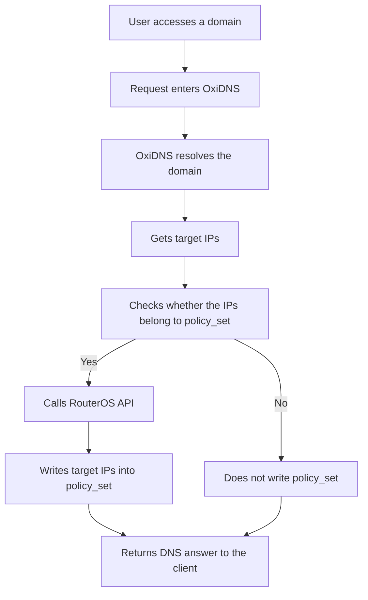
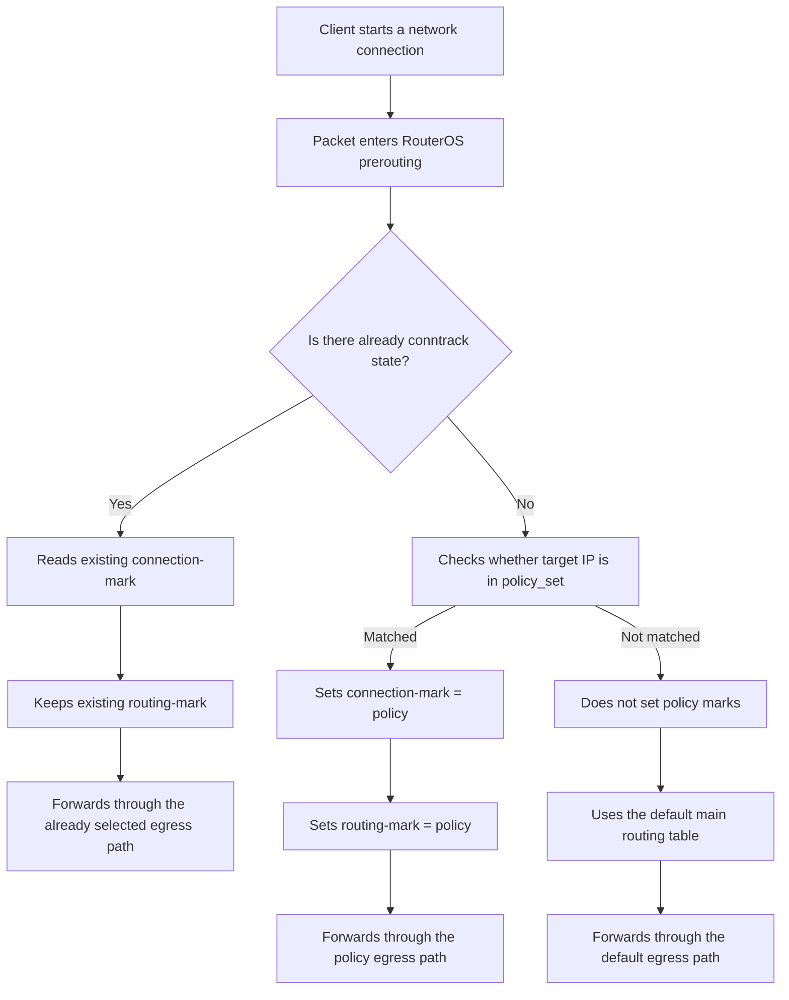

This chapter explains how the OxiDNS `ros_address_list` executor works with RouterOS `address-list`, `mangle`, and policy-routing mechanisms to build a system where DNS resolution results drive later egress selection.

The core idea is not to match domains directly inside RouterOS. Instead, the workflow is:

1. OxiDNS resolves the domain first.
2. It extracts the target IPs from the DNS response.
3. Matching target IPs are synced into RouterOS `address-list`.
4. During connection setup, RouterOS decides whether to apply policy marks based on whether the target IP matches that `address-list`.
5. The rest of the connection keeps using the derived connection mark and routing mark, so the selected egress stays stable.

This design matters because:

* RouterOS does not need to repeat domain-resolution logic.
* The routing decision happens at the IP layer, which maps naturally to RouterOS primitives.
* OxiDNS maintains the dynamic mapping from domain to target IP.
* RouterOS remains responsible for mapping target IPs to egress policy.

## Overall Workflow

### OxiDNS-Side Flow



### RouterOS-Side Flow



## Division of Responsibilities

### What OxiDNS Does

* Receives DNS requests.
* Resolves names according to policy.
* Extracts `A` and `AAAA` records from the final DNS response.
* Syncs target IPs that should follow policy routing into RouterOS `address-list`.
* Refreshes the lifetime of those IPs based on DNS TTL.

### What RouterOS Does

* Checks whether the destination address hits the policy set when a connection is first created.
* Applies `connection-mark` and `routing-mark` when it matches.
* Keeps later packets in the same connection on the same path without re-running policy logic.
* Uses `routing-mark` to select the proper routing table or egress.

## Good-Fit Scenarios

This pattern is especially useful when:

* The resolution results of a domain set must use a specific egress path.
* A service class should keep a stable egress instead of being randomly split across routes.
* RouterOS address-lists should be driven by domain policy sets instead of manually curated IP inventories.
* DNS-layer policy and network-layer policy should form a closed loop.

## Configuration Example and Parameter Notes

### Minimal Integration Example

This example shows:

* `qname` identifies policy domains first.
* Matching requests resolve normally.
* Once valid answers exist, `ros_address_list` writes the results into RouterOS `policy_set`.

```yaml
plugins:
  - tag: policy_domains
    type: domain_set
    args:
      exps:
        - "domain:stream.example"
        - "domain:media.example"

  - tag: match_policy_domain
    type: qname
    args:
      - "$policy_domains"

  - tag: forward_main
    type: forward
    args:
      upstreams:
        - addr: "udp://1.1.1.1:53"

  - tag: ros_address_list_policy
    type: ros_address_list
    args:
      address: "172.16.1.1:8728"
      username: "api-user"
      password: "secret"
      async: true
      address_list4: "policy_set_v4"
      address_list6: "policy_set_v6"
      comment_prefix: "oxidns"
      min_ttl: 60
      max_ttl: 1800

  - tag: seq_main
    type: sequence
    args:
      - matches: "$match_policy_domain"
        exec: "$ros_address_list_policy"
      - exec: "$forward_main"
```

## Key `ros_address_list` Parameters in Policy-Routing Scenarios

### `address`

```yaml
address: "172.16.1.1:8728"
```

Meaning:

* RouterOS API address.
* OxiDNS uses it to connect to RouterOS and manage address-list entries.

### `connect_timeout` / `send_timeout` / `receive_timeout`

```yaml
connect_timeout: 5
send_timeout: 5
receive_timeout: 30
```

Meaning:

* These values control RouterOS API connection, command send, and response receive waits, in seconds.
* All three values must be greater than `0`.
* `receive_timeout` is the wait for the next RouterOS response chunk, not a total cap for the whole scan.

Recommended practice:

* Use dedicated, size-controlled `address-list` targets for OxiDNS. Avoid connecting the plugin directly to existing large shared lists.
* If a legacy deployment cannot split the list yet, or the RouterOS management plane is slow enough that startup reconcile scans often exceed the default 5 seconds, increase `receive_timeout` first, for example to `30` or `60`.
* `connect_timeout` and `send_timeout` can usually keep their defaults unless the management network is slow or the RouterOS API is occasionally busy.

### `address_list4` / `address_list6`

```yaml
address_list4: "policy_set_v4"
address_list6: "policy_set_v6"
```

Meaning:

* Defines which RouterOS `address-list` receives IPv4 and IPv6 targets.

Recommended practice:

* Keep IPv4 and IPv6 separate.
* Use names that reflect policy intent, such as:
  * `policy_set_v4`
  * `policy_media_v4`
  * `policy_route_alt_v6`

### `async`

```yaml
async: true
```

Meaning:

* Whether RouterOS writes happen asynchronously.

Recommended practice:

* In policy-routing scenarios, `true` is usually the better default.

Why:

* DNS responses should not be noticeably delayed by RouterOS API latency.
* `ros_address_list` is primarily a side-effect and integration plugin, not the main resolution action.
* Startup-time RouterOS address-list scans run in the background, so slow legacy list queries or a slow management plane should not block DNS service startup.
* Backgrounding reduces the impact on DNS startup and the request path, but it does not make large address lists a recommended target.

### `min_ttl` / `max_ttl`

```yaml
min_ttl: 60
max_ttl: 1800
```

Meaning:

* Constrains the lifetime of dynamically written address-list entries.

Why it matters:

* Prevents very small TTLs from causing excessive RouterOS refresh churn.
* Prevents very large TTLs from keeping stale IPs around too long.

Tuning principles:

* `min_ttl`
  * Do not set it too low, or RouterOS refresh pressure rises.
* `max_ttl`
  * Do not set it too high, or old IPs may linger too long after target changes.

### `fixed_ttl`

```yaml
fixed_ttl: 300
```

Meaning:

* Ignores the original DNS TTL and always writes dynamic entries with a fixed lifetime.
* If set to `0`, dynamic entries are written without a RouterOS `timeout`.

Good fits:

* A predictable refresh interval is required.
* Upstream TTL differences should not change policy-routing behavior.

### `persistent`

```yaml
persistent:
  ips:
    - "1.1.1.1"
    - "203.0.113.0/24"
  files:
    - "/etc/oxidns/persistent_policy_ips.txt"
```

Meaning:

* Adds permanent entries in addition to dynamically learned DNS results.

Good fits:

* Some destinations must always remain in the policy set.
* Dynamic learning and static policy should coexist in one managed set.

## RouterOS Policy-Routing Model

OxiDNS only writes target IPs into `address-list`. The actual policy routing still happens on the RouterOS side.

The standard pattern has three steps:

1. Match `dst-address-list=policy_set` in `prerouting`.
2. Mark the first packet with `connection-mark`.
3. Derive `routing-mark` from `connection-mark`, then let the corresponding routing table choose the egress.

### Logic Breakdown

#### Step 1: Identify Whether the Destination Hits the Policy Set

RouterOS reads the destination IP and checks whether it belongs to the `address-list` maintained by OxiDNS.

This corresponds to:

```
Check whether target IP is in policy_set
```

#### Step 2: Mark the Connection

Once it matches, write `connection-mark=policy` immediately.

Why:

* Later packets in the same connection do not need to re-check the `address-list`.
* It prevents mid-connection route drift.

#### Step 3: Map the Connection Mark to a Routing Mark

Then derive `routing-mark=policy` from the `connection-mark`, and let the corresponding routing table forward traffic through the selected egress.

## Why Use Both `connection-mark` and `routing-mark`

Per-packet matching on destination IP alone is not enough for two reasons:

1. Later packets in the same connection should inherit the same routing decision.
2. The `address-list` may refresh dynamically, but an established connection should not change route midstream.

So the more stable model is:

* The first packet is evaluated against `address-list`.
* If it matches, write `connection-mark`.
* Later packets reuse connection state and therefore keep a stable `routing-mark`.

This matches the earlier RouterOS flow chart:

* Existing connections reuse state directly.
* Only new connections consult `policy_set`.

## Timing Between DNS and Connection Setup

This design relies on one practical assumption:

* The client usually sends a DNS query first.
* It then starts the network connection shortly afterward using the returned address.

So as long as OxiDNS writes the target IP to RouterOS quickly after answering DNS, the following connection will usually hit the expected address-list entry.

There are still boundary conditions:

* With `async: true`, writes are asynchronous.
* In theory there is a short window where the client has already started connecting, but RouterOS has not finished updating the `address-list`.

### How to Reduce the Impact of This Window

The impact can be reduced from three angles:

1. Keep the OxiDNS-to-RouterOS API path stable and low-latency.
2. Do not set `min_ttl` too low, which reduces RouterOS churn.
3. Use `persistent` for critical targets so the first dynamic write is not the only protection.

For environments where "the very first packet must already hit policy routing" is a strict requirement:

* Put the most critical targets into `persistent`, or
* Use `async: false` and accept the added latency on the DNS path.

## Common Composition Patterns

### Pattern 1: Only Write `policy_set` for Specific Domain Sets

Characteristics:

* Only DNS results for policy domains are synced into RouterOS.
* Default traffic still uses the main routing path.

Good fit:

* Only a small target set needs policy routing.

### Pattern 2: Write All Successful Resolutions Into Different Address-Lists

Characteristics:

* Different `sequence` branches write different result classes into different lists.

For example:

* `policy_media_v4`
* `policy_backup_v4`
* `policy_low_latency_v4`

Good fit:

* Multiple egress paths and multiple policy classes at once.

### Pattern 3: Merge Dynamic Learning with Persistent Policy

Characteristics:

* Dynamic DNS results are written into the address-list.
* Fixed critical prefixes or IPs remain pinned through `persistent`.

Good fit:

* Both dynamic policy and static fallback policy are required.

## Example: Multiple Policy Egress Paths

This example writes two domain groups into two different RouterOS `address-list` targets.

```yaml
plugins:
  - tag: media_domains
    type: domain_set
    args:
      exps:
        - "domain:media.example"

  - tag: backup_domains
    type: domain_set
    args:
      exps:
        - "domain:backup.example"

  - tag: media_match
    type: qname
    args:
      - "$media_domains"

  - tag: backup_match
    type: qname
    args:
      - "$backup_domains"

  - tag: forward_main
    type: forward
    args:
      upstreams:
        - addr: "udp://1.1.1.1:53"

  - tag: ros_address_list_media
    type: ros_address_list
    args:
      address: "172.16.1.1:8728"
      username: "api-user"
      password: "secret"
      async: true
      address_list4: "policy_media_v4"

  - tag: ros_address_list_backup
    type: ros_address_list
    args:
      address: "172.16.1.1:8728"
      username: "api-user"
      password: "secret"
      async: true
      address_list4: "policy_backup_v4"

  - tag: seq_main
    type: sequence
    args:
      - exec: "$forward_main"
      - matches:
          - "$media_match"
        exec: "$ros_address_list_media"
      - matches:
          - "$backup_match"
        exec: "$ros_address_list_backup"
```

On RouterOS, map:

* `policy_media_v4` to egress A
* `policy_backup_v4` to egress B

## Debugging and Troubleshooting

### Confirm Three Things on the OxiDNS Side

1. The domain really matches the intended policy branch.
2. The DNS response really contains `A` or `AAAA`.
3. `ros_address_list` successfully connects to RouterOS and submits the observed results.

Useful tools:

* `debug_print`
* `query_summary`
* RouterOS API logs

### Confirm Three Things on the RouterOS Side

1. The target IP actually appears in the `address-list`.
2. New connections match that `address-list` as expected.
3. `connection-mark` and `routing-mark` are written as intended.

## Risks and Boundaries

### 1. DNS and the Real Connection Target Are Not Always the Same

If a client:

* Caches DNS for a long time
* Does not use OxiDNS
* Uses some other resolver result

then the RouterOS-side policy set may no longer cover the actual connection target.

### 2. One Domain May Return Many Changing IPs

Some services change addresses frequently. In that case, tune these more carefully:

* `max_ttl`
* `fixed_ttl`
* `persistent`

Otherwise, possible symptoms include:

* Old IPs lingering too long
* Excessively frequent updates

### 3. Asynchronous Writes Create a Small Window

`async: true` is usually the recommended default, but it does not guarantee that RouterOS has already finished writing the address-list by the exact moment the DNS response is returned.

Stronger consistency requires trading DNS-path latency against write-path certainty.

## Implementation Recommendations

### Recommendation 1: Start with Small, Well-Bounded Policy Sets

Do not write everything into RouterOS on day one.

Start with:

* A few domain sets that clearly need policy routing
* One separate `address-list`
* One separate `routing-mark`

and validate the full loop first.

### Recommendation 2: Keep DNS Decisions and Routing Decisions Layered

OxiDNS is responsible for:

* Which domains belong to which policy class
* Which resolution results should be synced

RouterOS is responsible for:

* Which egress policy each synced IP belongs to

This separation clarifies ownership and reduces troubleshooting complexity.

### Recommendation 3: Prefer Connection Stability Over Re-Deciding Every Packet

The primary goal of policy routing is usually stable connections, not repeated policy evaluation on every packet.

So:

* `connection-mark` should be the core state.
* `routing-mark` should be derived from `connection-mark`.
* `address-list` should participate only in the first decision for new connections.

## Summary

The OxiDNS `ros_address_list` plugin is essentially a DNS-result synchronizer:

* It converts domain resolution results into target IP sets that RouterOS can consume.
* RouterOS then performs the actual policy routing based on those target IP sets.

The full loop looks like this:

1. OxiDNS decides how a domain should be resolved.
2. OxiDNS writes target IPs that match policy into `policy_set`.
3. RouterOS marks new connections based on `policy_set`.
4. RouterOS derives routing marks from connection marks.
5. Traffic leaves through the selected egress.

For the goal of "make later connections to specific domains consistently use a specific egress path", this is one of the most representative and practical ways to use the current OxiDNS `ros_address_list` plugin.
